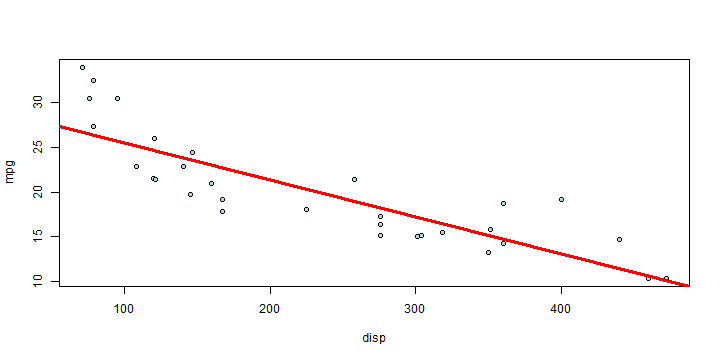

## Problem

- Doing Univariate Linear Regression Analysis in R is "easy" (not really, but running the commands is quite easy!)
- Provide opportunity to play around for colleagues without experience in R
- Using a shiny app that is available to everyone
- Use mtcars data set
- Want to predict mpg (miles per gallon) by different continuous features

--- .class #id 

## Dataset

- mtcars
- Data from the 1974 Motor Trend US magazine
- Comprises fuel consumption and 10 aspects of automobile design and performance 
- 32 automobiles (1973-74 models)
- mpg - Miles per gallon
- disp - Displacement (cu. in.)
- hp - Horse Power
- wt - Weight
- qsec - 1/4 Mile Time

--- 
## Shiny app example
- https://mlsports.shinyapps.io/C_DevData/
- Compare Predictions for disp, hp, wt, qsec separately to predict mpg
- Investigate regression line fit to the data and a summary of the fit to compare models
 

---
## Outlook 
- Include non-continous features
- Include option for Multivariate Regression
- Extend application to arbitrary datasets

